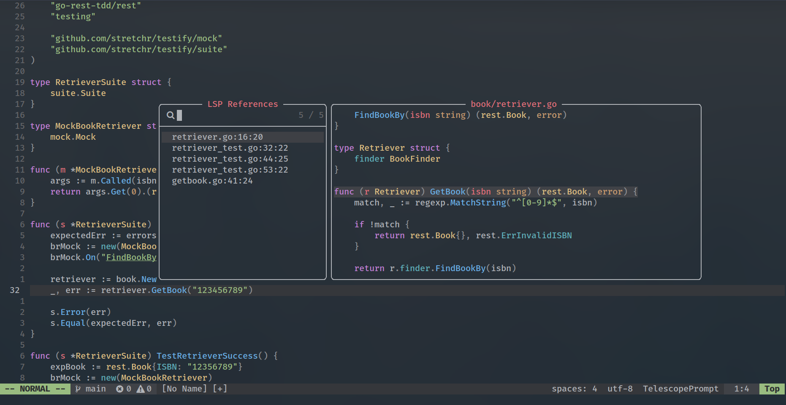

# My Neovim Config

A Neovim config based on ThePrimeagen's video [0 to LSP : Neovim RC From Scratch](https://youtu.be/w7i4amO_zaE?si=xstN83ebvGg8GgCt) and the following series ([Part 1](https://youtu.be/ZWWxwwUsPNw?si=B8oR7QCCAE6t0vlE), [Part 2](https://youtu.be/c0Xmd4PGino?si=52GovTGAj3cRIgPl), [Part 3](https://youtu.be/MuUrCcvE-Yw?si=222vzBRjywjIhDhj)). It offers a familiar IDE experience and has a simple structure, making it simple to add new plugins.



## Installation

### Install Neovim v0.9+

It's possible to install Neovim using your package manager, but be aware that Neovim may be upgraded to a newer version when you update your packages.
Installing Neovim from the [source code](https://github.com/neovim/neovim/wiki/#install-from-source) is necessary to ensure that it only updates when you want it to.

### Clone the config

Make sure to remove or backup your current `~/.config/nvim` directory.

```
git clone --depth 1 --branch v2.6.1 git@github.com:iktzdx/nvim.git ~/.config/nvim
```

### Plugins

[Lazy](https://github.com/folke/lazy.nvim) is used as a plugin manager. Run the `:Lazy` command to access the main menu.

Run `nvim .` and wait for the plugins to be installed.

**NOTE:** You'll probably notice [treesitter](https://github.com/nvim-treesitter/nvim-treesitter) installing a bunch of parsers the next time you re-open Neovim.

[Mason](https://github.com/williamboman/mason.nvim) is used to install and manage LSP servers, DAP servers, linters, and formatters via the `:Mason` command.

#### Plugin dependencies

In order for [Telescope](https://github.com/nvim-telescope/telescope.nvim) to work, the following tools are required:

-   [ripgrep](https://github.com/BurntSushi/ripgrep)
-   [fzf](https://github.com/junegunn/fzf)
-   [fd](https://github.com/sharkdp/fd)

For Golang integration:

-   SDK: [Go](https://go.dev/)
-   Language server: [gopls](https://pkg.go.dev/golang.org/x/tools/gopls#readme-installation)
-   Debugger: [delve](https://github.com/go-delve/delve)
-   Linters runner: [golangci-lint](https://github.com/golangci/golangci-lint)

## Features

-   LSP support (native LSP + [nvim-lspconfig](https://github.com/neovim/nvim-lspconfig) + [mason](https://github.com/williamboman/mason.nvim) + [mason-lspconfig](https://github.com/williamboman/mason-lspconfig.nvim)).
-   Formatter ([conform.nvim](https://github.com/stevearc/conform.nvim)) and linters ([nvim-lint](https://github.com/mfussenegger/nvim-lint)).
-   Git integration ([gitsigns](https://github.com/lewis6991/gitsigns.nvim) + [vim-fugitive](https://github.com/tpope/vim-fugitive)).
-   Auto-completion ([nvim-cmp](https://github.com/hrsh7th/nvim-cmp)) and code snippets ([luasnip](https://github.com/L3MON4D3/LuaSnip)).
-   Fuzzy find, live grep ([telescope](https://github.com/nvim-telescope/telescope.nvim)).
-   Improved navigation ([harpoon](https://github.com/ThePrimeagen/harpoon) + [leap](https://github.com/ggandor/leap.nvim)).
-   Debugging ([nvim-dap](https://github.com/mfussenegger/nvim-dap) + [nvim-dap-go](https://github.com/leoluz/nvim-dap-go)).
-   Testing ([neotest](https://github.com/nvim-neotest/neotest)).

## Usage

The main key mappings are listed in the file [keymaps.lua](lua/user/config/keymaps.lua).

The key mappings specific to plugins are placed in their corresponding configuration files (e.g. `lua/user/plugins/category_name/plugin_name.lua`).

Here are a few of the most commonly used key mappings:

-   `<leader>pf` — find file by name in the current project directory
-   `<leader>pv` — open netrw directory listing
-   `gd` — go to definition of the symbol under the cursor
-   `Ctrl-o` — go to older position in jump list
-   `Ctrl-i` — go to newer position in jump list
-   `K` — open man page for word under the cursor
-   `<leader>vrn` — rename the symbol under the cursor
-   `<leader>vca` — list all available code actions (fill struct, organize imports, etc.)
-   `<leader>imp` — list all the implementation of the word under the cursor
-   `<leader>ref` — list all the LSP references of the word under the cursor
-   `<leader>inc` — list all the LSP incoming calls of the word under the cursor
-   `<leader>dx` — list diagnostics for all open buffers
-   `]m` — move cursor to the beginning of the next method definition
-   `[m` — move cursor to the beginning of the previous method definition
-   `;` — repeat previous movement
-   `,` — repeat previous movement backwards
-   `%` — move cursor to matching character (default supported pairs: '()', '{}', '[]')
-   `Ctrl-p` — move to the previous item in the auto-completion menu
-   `Ctrl-n` — move to the next item in the auto-completion menu
-   `Ctrl-y` — select the current item in the auto-completion menu

## Learn more

-   [Vim Cheat Sheet](https://vim.rtorr.com/)
-   [Mastering the Vim Language](https://youtu.be/wlR5gYd6um0?si=-ZFLkO2ZvqYdIiZI)
-   [A VIM Notebook](https://github.com/omerxx/vim-notebook)
